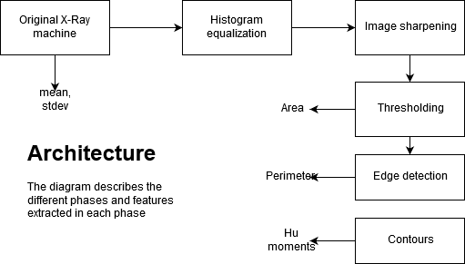
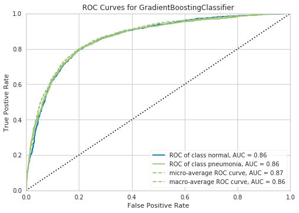

# Pneumonia-detection
Image processing based pneumonia detection through image enhancement and feature extraction

## Feature extraction pipeline

The code for the image enhancement and feature extraction is available in the notebook `DIP model.ipynb`

## Model development

Check the pdf of the report for more information
